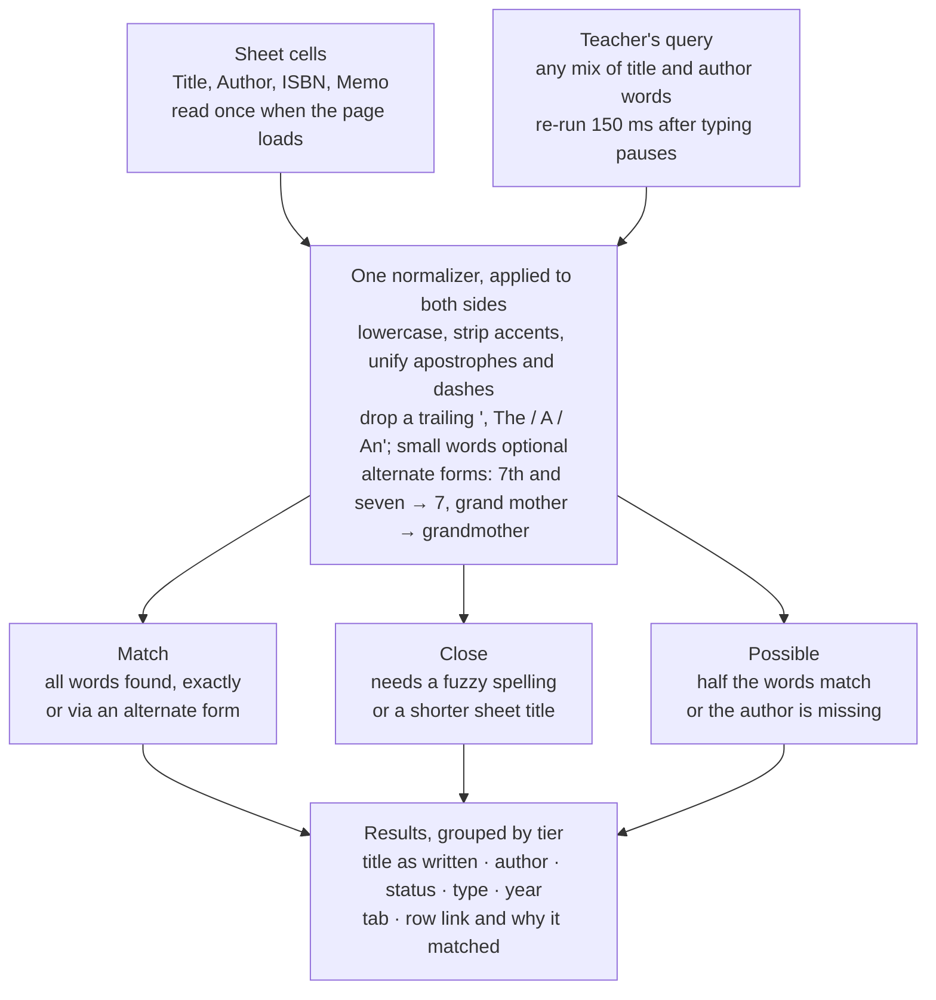

# CensorSearch — PRD

Exported 29 September 2026 from the working PRD doc, which remains the living version. The search prototype referenced below is in [`prototype/`](prototype/).

## Overview

CensorSearch is one static web page that searches the government's banned-materials Google Sheet live and lists every matching row, each linked back to its tab and row. It replaces Ctrl+F, which misses items stored as "2nd Helping of Chicken Soup, A", "451 Farenheit" or with no author at all.

**Success looks like:**

- A teacher finds any listed item in one search, typing what they naturally know: a title with or without its article, part of a title, an author's first or last name, or an ISBN.
- The app never implies "not on the list" when the item is listed under a variant spelling. Missing an item is worse than showing an extra one.
- Every result names its tab and row number and links straight to that row in the sheet.
- No server, no stored data, no accounts. The page reads the live sheet each time it loads.

**Sample file checked:** `Banned Materials by Ministry and Others 2004-2025 as of 28 September 26.xlsx` is in the project folder. It is an .xlsx (not .xls) with two tabs: **Sheet1** (20 items, rows 4–23) and **Other Materials** (5 items, rows 4–8). Both use a title in row 1, an "updated as of" date in row 2 and headers in row 3: Title, Author, ISBN, Banned By, Type, Year of Banning, Memo.

## Users and use cases

Teachers and librarians use it to check whether a book, DVD or other material is on the list before using it. Nobody signs in.

1. **Check a title.** Type all or part of it, with or without "The"/"A", in any word order. See every matching row.
2. **Check an author.** Type a first name, a last name or both. See everything listed under that author.
3. **Check an ISBN** copied from the back of a book, with or without hyphens.
4. **Verify in the source.** Click a result to open the sheet at that exact row.
5. **Later: check a reading list.** Paste several titles or authors separated by semicolons and get results grouped per term.

**Scope for v1:** the main tab (**Sheet1**) only. The Other Materials tab is updated rarely and holds 5 rows in the sample, so it is optional. Every result carries its tab name anyway, so adding a tab later is a one-line config change. The main tab has about 1,200 rows today. Arabic-specific matching is also out of v1: about 17 rows are in Arabic, and they still match when typed as written.

## Data source and architecture

The Google Sheet is the only data source. The page reads it read-only on every load, builds a search index in the browser's memory and keeps nothing.

- **Live and read-only.** Each page load fetches current data. No copy is stored anywhere, and the app never writes to the sheet.
- **No server of our own.** A Google-hosted, read-only endpoint (such as an Apps Script web app) is acceptable because it stores nothing.
- **One setting:** the sheet's URL plus the tab to search (v1: the main tab).
- **Any sheet URL (nice to have).** Someone can open the page with a different Google Sheets link, e.g. `…/?sheet=<link>`, and it works if that sheet has a header row with at least Title and Author. Mapping columns by header name makes this nearly free on our side. It must also work for sheets we can only view (not own), so the access method below cannot depend on changing a sheet's sharing or attaching a script to it.
- **Loading and failure states.** While loading: "Loading the list…". Once loaded: "N items · updated as of 28 September 2026 (from the sheet) · fetched 14:05". If the fetch fails, say so plainly and link to the sheet. Never show an empty result list that could be read as "not listed".

**Decision: two read paths, same app.**

1. **Default: read the sheet directly by link.** Any sheet shared as "Anyone with the link can view" (or published to the web) is downloaded as CSV straight into the page. No script is needed, and the sheet can be one we only view.
2. **Fallback: a read-only Apps Script web app** for sheets that can't be link-shared. A small Google-hosted script, running under an account that can view the sheet, returns the rows to the page and stores nothing. **The school's own sheet uses this path.**

Both paths feed the same header mapping, index and search, so the rest of this PRD doesn't depend on which one a sheet uses.

**Who can use the Apps Script path (v1): anyone with the page's link, with no sign-in.** The script runs as its owner and returns only the mapped columns (Title, Author, ISBN, Banned By, Type, Year of Banning, Memo), never the rest of the sheet. People without access to the sheet can search it this way, but its row links open only for people who have access. That's acceptable for v1. Restricting the app to school accounts can come later.

### How the page reads the sheet

Each method below was tested live against public Google sheets on 29 September 2026, then fact-checked adversarially. Only what survived is shown.

| Method | What it needs | Live? | Row numbers | Colours and memo links | Verdict |
| --- | --- | --- | --- | --- | --- |
| CSV export by link (`/export?format=csv&gid=…`) | Sheet shared "Anyone with the link can view" | Yes, never cached | Exact; hidden and filtered rows included | No | **Default path** |
| XLSX export by link (`/export?format=xlsx`) | Same | Yes | Exact | Yes, but no tab ids and a bigger parser | Not needed: colour only mirrors Banned By |
| Apps Script web app returning JSON | A script owned by a school account with view access, deployed to "Anyone" | Yes (no cache by default) | Exact, plus hidden-row flags and tab ids | Yes | **Fallback; the school's sheet** |
| Google Visualization query (`gviz/tq`) | Link sharing | Yes | None; hidden rows silently dropped | No | Rejected |
| Publish to web | The owner publishes, making the list public at a new URL | Lags by minutes | Exact | Only for whole-document publishing | Rejected: owner action, and it publishes the list |
| Sheets API with a key | Link sharing plus a Google Cloud project and key | Yes | Exact | Yes | Rejected: same sharing need as CSV, more setup |

- **Default path.** One fetch per page load of the tab named by the link's `gid` (the first tab if the link has none). Verified: Google allows the cross-site request, sends no-cache headers, includes hidden and filtered rows, and exports 13-digit ISBNs in full. A real CSV parser (header off, empty lines kept) makes row = record number.
- **Fallback path.** A standalone Apps Script, not attached to the sheet, owned by a long-lived school role account rather than a teacher who might leave. That account gets **Viewer** access to the sheet, which keeps the script read-only even though Google's open-by-id permission is broad. It returns display values, raw values (exact ISBNs), memo link URLs, fill colours, hidden flags and tab ids, for the mapped columns only. Verified: a plain GET to an "Anyone" web app works cross-site.
- **No Google-side cache by default**, to honour "no stored data". Apps Script allows 30 simultaneous runs; a cache of 5 minutes or less is the lever if load ever becomes a problem.
- **Risk.** A Workspace admin can disable Apps Script, or "Anyone" deployments (the second is community-reported, not documented). Then the fallback needs school sign-in and the page is served by Apps Script itself, the "later" option.
- **Hosting.** The page must be served over https; GitHub Pages works. Opened from disk (`file://`), Google refuses the request.
- **Row links** use `https://docs.google.com/spreadsheets/d/<id>/edit?gid=<gid>#gid=<gid>&range=A<row>:G<row>` and open in a new tab. Verified signed out on a link-shared sheet: it opens view-only with the row selected. It works only for people who can open the sheet.
- **Failure.** A sheet that isn't link-shared fails as a generic network error. The page says "Can't read this sheet: it may not be shared by link, or a network filter may block Google" and never shows an empty result list.

## Search hiccups

The 25 sample rows already show more than 40 distinct ways a search can miss. In a simulated run, plain Ctrl+F missed 45 of 79 realistic teacher queries against them. The app closes these gaps with one rule set applied identically to sheet cells and to what the teacher types. A prototype built on these rules ran 180 teacher queries: it found 153 of 162 expected rows as first drafted and all 162 after 17 fixes, which the tables below now include.

Rules **add** alternate forms and never replace the original. "Second" also indexes as 2, but "Seconds" still matches literally.

**Reading the tables:** "In the sheet" cites the sample as *Tab rN* when the problem is already there; otherwise it says "not in sample" with a realistic example. **Priority** is a dropdown in the working doc. *v1 must* blocks launch, *v1 should* ships in v1 if cheap, and *Later* comes after launch.

### Articles and word order

| Hiccup | In the sheet | Teacher types | App's rule | Priority |
| --- | --- | --- | --- | --- |
| Article moved to the end | Sheet1 r10 "2nd Helping of Chicken Soup, A"; r19 "7 Habits of Highly Effective Teens, The"; r20 "7th Knot, The" | "The 7th Knot", "A 2nd Helping of Chicken Soup" | Strip a trailing ", The/A/An" for matching; show it back at the front in results ("The 7th Knot"). | v1 must |
| Articles kept in some rows, or mid-title | Sheet1 r21 "A Series of Unfortunate Events - The Wide Window -Book 3" keeps its leading "A" | "Series of Unfortunate Events", "Wide Window" | the, a, an (and of, and, or, to, in, on, at, for, by, with, from) are never required anywhere. Matching them only raises the rank. | v1 must |
| Article before a subtitle | Not in sample; e.g. "Alchemist, The: A Fable About Following Your Dream" | "The Alchemist" | Also detect ", The" right before a colon, dash or bracket. | v1 must |
| Non-English articles | Not in sample; e.g. "Petit Prince, Le", "Alquimista, El" | "Le Petit Prince", "El Alquimista" | Strip a trailing ", Le/La/Les/El/Die…" in the sheet. When a query starts with one, search with and without it. Never drop these words outright ("Die Hard", "La La Land"). | v1 should |
| Words in a different order | Sheet1 r16 "451 Farenheit" (the book is *Fahrenheit 451*) | "Fahrenheit 451" | Words match in any order; an exact in-order phrase ranks higher. | v1 must |
| Title and author in one box | Sheet1 r9: 1984 and George Orwell sit in separate cells | "orwell 1984", "1984 by George Orwell" | Each query word is checked against Title and Author together; "by" is ignored. | v1 must |
| Titles made only of small words | Not in sample; e.g. "A" (Louis Zukofsky), "The The" | "a", "the the" | If stripping articles leaves nothing, keep the full title as its key and require its words. An empty key never matches. | Later |
| Letter ranges that look like moved articles | Not in sample; e.g. "Animals, A-Z" | "animals a to z" | Don't move the article when it is followed by a dash and one letter; index "a to z" and "atoz" as alternates. | Later |

### Punctuation, spacing and characters

| Hiccup | In the sheet | Teacher types | App's rule | Priority |
| --- | --- | --- | --- | --- |
| Dashes vs hyphens | Other Materials r5–r8 use en dashes ("Amplify CKLA – Unit 4…"); Other Materials r4 uses hyphens | "Amplify CKLA - Unit 4" | Every dash and hyphen becomes a space on both sides. | v1 must |
| Apostrophes | Sheet1 r22 "Aaron's Hair" and r23 "Aaron's Magic Village" (straight ') | "Aaron’s Hair" (curly ’ from an iPhone or Mac), "Aarons Hair" | Unify every apostrophe shape, then delete it: aaron's, aaron’s and aarons all become "aarons". | v1 must |
| Colons, commas, brackets, missing spaces | Sheet1 r12 "2001 User Guide: World Book: International Edition"; r21 "-Book 3" with no space | "World Book 2001", "Wide Window Book 3" | All other punctuation and symbols become spaces; repeated spaces collapse. | v1 must |
| & vs "and" | Sheet1 r15 "360 and More Fairy Tales" | "360 & More Fairy Tales"; "Jekyll and Hyde" for a row with "&" | & and a standalone + become "and", which is ignorable. | v1 must |
| Hyphenated words | Sheet1 r11 "20 10-Minute Plays For Teens"; r18 "One-Minute Monologues" | "10 minute plays", "10minute plays" | Index both the split and the joined form ("10 minute", "10minute"). | v1 must |
| Compounds split or joined | Sheet1 r5 "101 Stories of Grand Mother"; not in sample: "Spider-Man" | "Grandmother", "Spiderman" | Also index each pair of adjacent words joined ("grandmother"), and try the same on the query. | v1 must |
| Case, extra and invisible spaces | Other Materials r5, r7, r8 end with a space; the Sheet1 notes cell has line breaks. Not in sample: non-breaking or zero-width spaces from pasted text | "AMPLIFY CKLA  UNIT 4", a title pasted from a PDF or WhatsApp | Lowercase; turn every kind of space and line break into one space; delete invisible characters; convert full-width characters (Unicode NFKC). | v1 must |
| Accents | Not in sample; e.g. "Brontë", "Pokémon", "Les Misérables" | "Bronte", "Pokemon" (or the reverse) | Strip accents on both sides; map æ→ae, ß→ss, ø→o. | v1 must |
| Catalogue-search habits | Query side only | "harry pot\*", ""wide window"", "orwell AND 1984" | Ignore \* ? " !; treat and/or as ignorable. The last word already matches as a prefix. | v1 should |
| Symbols that carry meaning | Not in sample; e.g. "C++ for Teens", "A+ Spelling" | "c++" (would fold to the single letter "c") | A short symbol table: c++ → cplusplus, c# → csharp, a+ → aplus. | Later |

### Numbers

| Hiccup | In the sheet | Teacher types | App's rule | Priority |
| --- | --- | --- | --- | --- |
| Digits vs words | Sheet1 r19 "7 Habits…"; r7 "13 Little Blue Envelopes"; r11 "Volume One" but r18 "Volume 2" in the same tab | "Seven Habits", "Thirteen Little Blue Envelopes", "Volume 1" | Number words get digit alternates on both sides (seven→7, twenty-one→21). The word stays too, so "The Chosen One" still matches "one". | v1 must |
| Ordinals | Sheet1 r10 "2nd Helping…"; r20 "7th Knot, The" | "Second Helping of Chicken Soup", "The Seventh Knot" | 2nd and second → 2; 7th and seventh → 7, as alternates. "Seconds" (r18) still matches literally. | v1 must |
| Years written as words | Sheet1 r9 1984 | "Nineteen Eighty-Four" (Orwell's original title) | Two number words where the first is 10–99 also give the joined year (1984), plus the separate numbers. | v1 should |
| Numbers said aloud as digit groups | Sheet1 r16 "451 Farenheit"; r13 "211 Things…"; r15 "360 and More Fairy Tales" | "Fahrenheit four fifty-one", "two eleven things" (also what voice dictation produces) | A number word from 1 to 9 followed by one from 10 to 99 also gives the joined number (four fifty-one → 451). | v1 should |
| Number words fuzzy-matching small words | Sheet1 r11 "…Plays For Teens"; Other Materials r4 "…English For Class - 8" | "four" (one letter from "for"), "nine", "five" | Number words, like digits, get no fuzzy matching, so "four" never matches "for". | v1 must |
| Misspelled or run-together number words | Titles use digits: Sheet1 r9 1984, r14 "30 Days Disc" | "ninteen eighty four", "ninty days", "twentyone" | A short table of common misspellings (ninteen, ninty, fourty, eigth, twelth) and joined forms, checked before fuzzy matching. | v1 should |
| Roman numerals | Other Materials r4 "…For Class - 8" (the cover says Class VIII); not in sample: "Volume II", "World War II" | "Class VIII", "Volume II", "WWII" | ii–xxx get digit alternates; single i, v and x only right after volume, book, part, class, grade or unit. Never inside names ("Mix", "Liv"). | v1 should |
| Label and number pairs | Other Materials r5–r8: each "Unit N" with "Grade 5"; r4 "Class - 8"; Sheet1 r21 "-Book 3" | "ckla unit 5" (the prototype first returned all four units), "book 3" (19 rows), "grade 8" for "Class - 8", "Vol. 1", "#3", "5th grade", "Grade K" | Index label + number as one term (unit4, grade5, book3). Class, grade and standard share a key; vol/bk/gr/# expand; K and kindergarten = grade 0. A pair in the query must match exactly; the same label with another number drops to Possible. | v1 must |
| Number ranges in titles | Not in sample; e.g. "Harry Potter Books 1–7", "Grades 3–5" | "harry potter book 4" | Index every label + number in a range of up to 20 (book1…book7); the card notes "covers Books 1–7". | v1 should |
| Thousands separators | Not in sample; e.g. "20,000 Leagues Under the Sea" | "20000 leagues", "Twenty Thousand Leagues" | Remove commas inside digit groups; "hundred" and "thousand" multiply. | v1 should |
| Short numbers flood results | Ctrl+F "13" hits r7, r8, the year "2012-2013" and an ISBN; "20" hits all 25 rows | "13", "20" (on the way to "2001") | Numbers match whole words in Title and Author; digits prefix-match only from 3 digits. Year of Banning and Banned By are shown, not searched. | v1 must |
| Year of Banning typed into the query | Sheet1 r9 "2023-2024" | "orwell 2023-2024", "banned 2024-2025" (copied from a memo) | A year range in the query is optional: it never blocks a match and boosts rows whose Year of Banning equals it. A lone 4-digit year stays a required title word (1984, 2001). | v1 should |
| Fractions and times | Not in sample; e.g. "Fractions 1/2", "24/7", "9/11 Report" | "12" should not find "Fractions 1/2" | Index the parts of 1/2 or 3:15 but not the joined number, except a short list (9/11 → 911). | Later |

### Spelling variants and typos

| Hiccup | In the sheet | Teacher types | App's rule | Priority |
| --- | --- | --- | --- | --- |
| Typos in the sheet | Sheet1 r16 "Farenheit"; r6 "Melvn Berger"; r14 "Morgan Suprlock"; Other Materials r4 "Supplementay" | "Fahrenheit 451", "Melvin Berger", "Morgan Spurlock" | Fuzzy match per word: no edits up to 3 letters, 1 for 4–7, 2 for 8 or more; swapping two letters counts as one edit. The first or second letter must agree, so a dropped first letter (Tchekhov vs Chekhov) is missed. Labelled "similar spelling: Farenheit". | v1 must |
| Typos and autocorrect in the query | Sheet1 r22 "Robert Munsch"; r21 "Lemony Snicket" | "Munch", "Orwel", "Bradbery" | Same rule; the word still being typed gets at most 1 edit. | v1 must |
| A one-word query hits a real word one letter away | Sheet1 r4 "Jovial Bob Stine" vs r18 "…To Shine…" | "stine" (the prototype first returned "60 Seconds To Shine" as a full match; at 20,000 rows it returned 81: stone, spine, stint…) | When a one-word query matches something exactly or by prefix, rows found only by fuzzy spelling go to Possible. | v1 must |
| Plurals and word forms | Sheet1 r15 "Fairy Tales"; r18 "Monologues For Women"; r5 "Grand Mother" | "fairy tale", "monologue for woman", "grandmothers stories", "wimpy kid diaries" | Plural alternates for words of 4+ letters (ies↔y, ves↔f, es, s), also tried on joined pairs, plus a few irregulars (women/woman, children/child, mice/mouse). They count as exact, not fuzzy. | v1 should |
| British vs American spelling | Not in sample; e.g. "The Boy in the Striped Pyjamas" | "Striped Pajamas", "color" for "colour" | Alternates for -our/-or, -ise/-ize and -tre/-ter, plus a short word list (pyjamas, grey, mum). Fuzzy matching catches the rest. | v1 should |
| Abbreviated words | Not in sample; e.g. "Mr. Popper's Penguins", "Dr. Jekyll and Mr. Hyde" | "Mister Popper's Penguins", "Doctor Jekyll" | Two-way alternates: mr/mister, dr/doctor, st/saint, mt/mount. | v1 should |
| Acronyms | Other Materials r5–r8 "Amplify CKLA" (Core Knowledge Language Arts) | "Core Knowledge Language Arts unit 4" | A short, editable alias list expands the query; results are labelled "via alias". Until then, the no-results text suggests trying the acronym. | Later |
| Sound-alike spellings beyond fuzzy reach | Not in sample; e.g. "Chekhov" vs "Tchekhov" | Whatever spelling they remember | Phonetic matching (Double Metaphone) as a last-resort tier. | Later |

### Authors

| Hiccup | In the sheet | Teacher types | App's rule | Priority |
| --- | --- | --- | --- | --- |
| Missing author | 10 of 25 sample rows have none, e.g. Sheet1 r8 "1984: A DVD Study Guide…", r12, r15, r17, r23 | "Orwell" (misses the r8 study guide), "orwell 1984" | Show "author not listed". If a query word fails only because the row has no author, still show the row as a possible match. A standing tip reads "Many rows have no author; search the title too." | v1 must |
| Name order | The sample is all "First Last" (Sheet1 r9 "George Orwell"); a 20-year list likely also has "Orwell, George" | "Orwell George", "Bradbury, Ray" | Author words match as an unordered set; commas are ignored. | v1 must |
| Initials | Not in sample; e.g. "R.L. Stine", "J.K. Rowling", "C.S. Lewis" | "RL Stine", "R L Stine", "Stine, R.L.", "Orwell, G." | "R.L.", "R. L." and "RL" become one initials word. Initials are optional only beside a word that matches the row's author, so "R.L. Stine" still reaches "Jovial Bob Stine", labelled "given names differ". Elsewhere single letters are required (see "Plan B" under odd queries). | v1 must |
| Middle names, suffixes, titles, roles | Not in sample; e.g. "Martin Luther King Jr.", "Dr. Seuss", "Sean Covey (Author)" | "Martin Luther King", "Seuss" | jr, sr, dr, mr, author, editor, ed., illustrator and translator are optional. Extra given names never exclude a row. | v1 should |
| Surname particles | Not in sample; e.g. "Ursula K. Le Guin", "Madeleine L'Engle", "Tim O'Brien" | "LeGuin", "Lengle", "OBrien" | Joined forms and apostrophe deletion cover these. Le, de, van, von and al stay searchable and are never stripped. | v1 should |
| Pen names | Sheet1 r4 "Jovial Bob Stine" (an early pen name of R. L. Stine); r21 "Lemony Snicket" (Daniel Handler) | "R.L. Stine", "Daniel Handler" | The surname already finds Stine. A small editable alias list covers known pen names, labelled "via alias". | Later |
| "Et Al" and unlisted co-authors | Sheet1 r10 "Jack Canfield Et Al"; r18 "John Capecci Et Al" | "Mark Victor Hansen" (not in the sheet), "Canfield and Hansen" | Strip "et al" and "and others" before indexing; split multiple authors on &, and, ; and /. A query naming two authors finds rows with either as a possible match. The no-results text notes that co-authors after "Et Al" aren't listed. | v1 should |
| Publisher in the Author column | Sheet1 r5 "Arora Book Company" | "Arora" (hits); the real author (cannot hit) | Index the cell as written; company, press, publishers, books and inc are optional words. | v1 should |
| Surnames that are common words | Not in sample; e.g. authors named King, Green, White | "King", "Green" | For a one-word query, author matches rank above title matches, and each result says which field matched. | v1 should |
| Placeholder authors | Not in sample; e.g. "Unknown", "Anonymous", "Various", "N/A", "-" | "orwell 1984" should still fall back on a row whose author reads "N/A" | Treat placeholders as blank for matching and for the missing-author rule, but display them as written. | v1 should |

**Alias lists** are one small hand-kept file in the repo, `aliases.json`, for names the sheet doesn't contain: pen names (Daniel Handler → Lemony Snicket), acronyms (CKLA ↔ Core Knowledge Language Arts) and alternate titles (Philosopher's Stone ↔ Sorcerer's Stone). The app only uses it to widen a query, and results found this way are labelled "via alias". It can start empty.

### Titles: partial, longer, series, editions, look-alikes

| Hiccup | In the sheet | Teacher types | App's rule | Priority |
| --- | --- | --- | --- | --- |
| Partial title | Sheet1 r18 "60 Seconds To Shine Volume 2: 221 One-Minute Monologues For Women" | "60 Seconds to Shine", "one-minute monologues" | Default rule: every meaningful query word must be in the row. The word being typed matches as a prefix from 3 letters. | v1 must |
| Query longer than the sheet's title | Sheet1 r10 "2nd Helping of Chicken Soup, A" (the book adds "for the Soul"); r19 lacks the subtitle "The Ultimate Teenage Success Guide"; r9 is just 1984 | The full title copied from the cover, Amazon or Goodreads; "Nineteen Eighty-Four by George Orwell (Penguin Modern Classics)" | Reverse check: if every meaningful word of a row's title is in the query, the row is a close match despite extra words. A one-word title ("1984") qualifies only when matched exactly and one of the row's author words is also in the query. Rows matching at least half the query's words show as possible. | v1 must |
| Series vs volume title | Sheet1 r21 "A Series of Unfortunate Events - The Wide Window -Book 3" | "The Wide Window (A Series of Unfortunate Events, #3)", "Unfortunate Events book three" | #3, no. 3, bk 3, book three and vol 3 become the same pair term (book3). Bracketed series tags are covered by the reverse check. | v1 must |
| Series name matches a single-volume listing | Sheet1 r21 lists Book 3 only | "A Series of Unfortunate Events" returns r21 as a full match | Add a card note: "This listing names Book 3 only." The teacher must not read it as the whole series, or as the other volumes being cleared. | v1 should |
| A row covering a whole series or all works | Not in sample; e.g. "Goosebumps series", "Captain Underpants - all titles" | One volume's title, e.g. "Say Cheese and Die!" | Flag rows whose title says series, all titles, collection or box set, and pin them first when the author or series name matches, labelled "covers a whole series". Tip: "Also search the series name and author." | v1 should |
| Format and edition words | Sheet1 r14 "30 Days Disc" and r17 "500 Nations Disc" (Type says CD); r12 "…International Edition" | "30 Days DVD", "1984 paperback", "The Alchemist 25th Anniversary Edition" | Format and edition words (book, disc, dvd, cd, video, paperback, kindle, novel, edition, anniversary, illustrated…) are optional and only raise the rank. They are required only when the query has nothing else. | v1 must |
| Junk pasted into a cell | Sheet1 r8 "1984: A DVD Study Guide+3:15A13:153:173:193:401" | "1984 study guide"; "13" should not find it | Show the cell unchanged; don't index a trailing "+digits:…" run. List it in a data-quality note for the maintainers. | v1 should |
| Pasted listings, citations and questions | Query side | "The 7 Habits of Highly Effective Teens: … Paperback – December 1, 1998", "Orwell, G. (1949). Nineteen eighty-four.", "is 1984 by orwell banned" | Drop dates, star ratings and "(Author)"; question words (is, can, banned, allowed) are optional. The reverse check does the rest. | v1 should |
| Pasted URLs | Query side | An Amazon or Goodreads link | Pull an ISBN or the title words out of the link and search those. | Later |
| Regional or alternate titles | Not in sample; e.g. "…Philosopher's Stone" vs "…Sorcerer's Stone" | The other country's title | Shared words put the row in the possible tier; an optional alias list handles known pairs. | Later |
| Look-alike but different works | Sheet1 r8 (a DVD study guide) vs r9 (the novel 1984); r19 "…Teens" vs the unlisted "…People" | "1984", "7 Habits" | Show every matching row with full title, author, type, Banned By and row link, with matched words highlighted, so the teacher decides. Exact whole-title matches rank first. | v1 must |
| Same work in several rows | Likely in the full sheet: one title banned by a school code one year and by the Ministry later | Any title | Never merge rows. Group rows with the same normalized title and author; within a group the Ministry row sits on top, so "Must remove" is never buried under "Check". | v1 must |

### ISBNs

| Hiccup | In the sheet | Teacher types | App's rule | Priority |
| --- | --- | --- | --- | --- |
| ISBNs stored as numbers, typed in many formats | Other Materials r5 9798891808546 (a number cell); r4 8174508355 | "979-8-89180-854-6", "ISBN: 9798891808546" | Keep only digits and X; strip "ISBN", "ISBN-13:" labels; restore a lost leading 0 on 9-digit values. Google's CSV export keeps all 13 digits (verified). A value that arrives as 9.79889E+12 (only if the sheet is set to Scientific format) has lost its digits: skip it and flag it. | v1 should |
| ISBN-10 vs ISBN-13, bad check digits | Other Materials r4 8174508355 fails the ISBN-10 check; "978" + value is a valid ISBN-13, so the book's barcode reads 9788174508355 | "81-7450-835-X", "9788174508355" | Compare the 9-digit core and ignore check digits, so 8174508355, 817450835X and 9788174508355 all match. Never reject a sheet value for a bad checksum. | v1 should |
| Results vanish while an ISBN is typed | Other Materials r5–r8 share the prefix 97988918 | Typing digit by digit: the prototype showed rows at 9 digits, nothing at 10–12, then the row again at 13 | From 6 digits, ISBNs prefix-match into a separate "ISBN starts with…" group; exact 10- or 13-digit hits join the main list. | v1 must |
| An ISBN inside a longer query | Query side | "Fahrenheit 451 ISBN 978-1-4516-7331-9"; "little blue envelopes 13 2008 2009" must not become an ISBN | Join digit groups into an ISBN only after an "ISBN" label, when they start 978/979 and total 13 digits, or in a hyphenated ISBN shape; never across a year. In a mixed query the ISBN is optional. | v1 should |
| Several ISBNs or placeholders in one cell | Not in sample; e.g. "9780141036144 / 9780452284234", "N/A", "-" | The second ISBN | Extract and index each ISBN-shaped run separately; ignore placeholders; display the cell as written. | v1 should |
| ISBN column mostly empty | Sheet1 C4:C23 are all empty | The ISBN of the book in hand | An ISBN search with no hit says "No ISBN match. Most rows have no ISBN, so search the title and author." | v1 must |
| Turning an ISBN into a title | Not applicable | Only an ISBN | Optional later: look the ISBN up in Open Library, then search the title it returns. Off by default because it sends the query to a third party. | Later |

### Sheet structure and data access

These don't come from what teachers type. They change what the search sees, and each one can silently cause misses or wrong row numbers.

| Hiccup | In the sheet | Symptom if ignored | App's rule | Priority |
| --- | --- | --- | --- | --- |
| Headers on row 3, under banner rows | Rows 1–2 are a merged title and "updated as of…"; headers sit in row 3 | Banner text shows up as results; every row number is off | Find the header row: the first of the top 10 rows with any cell reading "Title" or a synonym (not just column A, since lists often add a "No." column). Map columns by header name, not position. This is also what lets the app accept other sheets. | v1 must |
| Notes box on a data row | Sheet1 H5:L22 holds the red/blue legend, on the same row as r5 "101 Stories of Grand Mother" | "ministry", "library" or "red" wrongly return r5 | Index only the mapped columns and ignore everything to their right. Parse with a real CSV parser, header detection off and empty lines kept; never split on line breaks, or the notes' 7 line breaks shift every later row. | v1 must |
| Searching every column floods results | Banned By "KES" matches "Jokes" (r4, r6); "book" hits 19 of 25 rows through Type; "ministry" hits 16 | "KES", "book", "ministry" and "2009" return noise | Search Title, Author, ISBN and Memo. Type and Banned By can complete a match ("ministry dvd") but never create one alone. Year of Banning isn't searched. | v1 must |
| A title stored as a number or date | Sheet1 r9 1984 is a numeric cell among text titles; not in sample: titles like "11/22/63" turned into dates | "1984" shows as "1984.0", or a date title as a serial number | Always turn values into text as displayed. The Visualization endpoint is avoided because it drops hidden rows and blanks text inside number columns (e.g. an ISBN ending in X). | v1 must |
| Status from Banned By | Sheet1 notes: red = Ministry (must remove), blue = UAS, others case by case. The two tabs use different reds; CSV drops colour. Not in sample: "Minstry", "MOE", "KES / Ministry", blanks | A Ministry row with a variant spelling or two codes shows "check case by case", a silent downgrade | Split Banned By on / , ; & and "and". Any part within one edit of Ministry or MOE → "Must remove (Ministry)"; UAS → "Banned by UAS"; blank → "Status not stated, open the row"; otherwise "Check case by case" plus the code. When in doubt, show the more severe status. Colour only highlights what Banned By already says (confirmed), so it is never read. | v1 must |
| Merged data cells | Not in sample; a maintainer merges D8:D9 = "Ministry" | Row 9's Banned By arrives empty and its status is downgraded | The Apps Script path copies the merged value to every row it covers. CSV can't see merges, so an empty Banned By shows "Status not stated, open the row". | v1 must |
| A load failure looks like "no results" | A web filter blocks Google's download domain, the sheet is made private, a tab is deleted or the layout changes | "1984" shows "No listing found" when nothing was loaded | Explicit states: loading (a typed query waits), loaded (N rows, the sheet's "updated as of", fetch time), partial (names the failed tab), failed (the error and a Retry button). Never search an empty dataset. | v1 must |
| Unsafe cell text and links | Every sheet editor controls cell text and link targets; Sheet1 r21 and Other Materials r5–r8 link to Drive | A title containing HTML, or a javascript: link, would run in teachers' browsers | Render cell text as text, never HTML; accept only https links; open them with rel="noopener noreferrer"; restrict which sites the page may contact. | v1 must |
| Several tabs | Sheet1 and Other Materials, each with its own "updated as of" date. Ctrl+F in Sheets searches only the open tab | "Amplify CKLA" misses while viewing Sheet1 | v1 searches the main tab. Tabs are configured by id, which survives renames, and each result shows its tab, so adding Other Materials later is configuration only. | v1 must |
| Exact row references | Data starts at row 4; rows are inserted and re-sorted as bans are added | The link lands on the wrong item | Row = record number in the raw export, counting every row. Link to the row in a new tab. Fetch fresh on every page load, show "data loaded at hh:mm" with the sheet's "updated as of" line, and reload after 30+ minutes open. | v1 must |
| Empty but formatted rows | Other Materials has 1,005 rows, 997 of them empty; Sheet1 r24–r25 have borders only | Blank results or slow loading | Skip rows whose Title, Author and ISBN are all empty. | v1 must |
| Tabs that aren't ban lists, and new columns | Not in sample; likely tabs "Lifted bans", "Archive", "Template"; likely columns "Status", "Reason" | A lifted ban shows as an ordinary hit | Search only configured tabs that have a Title header. Result cards show every non-empty column, including unmapped ones such as Status. | v1 should |
| Repeated headers and section headings | Not in sample; pasted blocks with their own header row, or headings like "2024-2025 additions" | "title" or "2024" returns a header or heading as an item | Skip rows equal to the header names; treat single-cell heading rows as context, not items. | v1 should |
| A row moves between load and click | Sheet1 is alphabetical, so each insert shifts the rows below it | The link opens a different item | Each result keeps a fingerprint (title, author, Banned By, year). If the data is over 5 minutes old at click time, re-fetch in memory, find the row again and open its current position, noting "moved from row 7 to 8". | v1 should |
| Hidden and filtered rows, hidden tabs | Both tabs have a filter on A3:F; nothing is hidden today | The link lands on a row the teacher can't see | Search hidden and filtered rows (the CSV includes them); label them "may be hidden by the sheet's filter" when the path can tell. Search hidden tabs only if configured. | v1 should |
| Link opens in the wrong Google account | Teachers are often signed in to a personal and a school account at once | "You need access", despite having access | Show "Tab · row N" as plain text beside the link, with a hint to switch to the school account. | v1 should |
| Memo links | Sheet1 r21 memo "751459" and Other Materials r5–r8 "Amplify CKLA" link to Drive files | The teacher can't open the memo from the app | The Apps Script path returns the link URLs, so show them as links; the CSV path shows the memo text only. | Later |
| Memo outside the filter range | The filter covers A:F but Memo is column G | Sorting through the filter leaves memos beside the wrong titles | The app can't detect this. Add "extend the filter to A:G" to the maintainer notes. | Later |
| Strikethrough for lifted bans | Not in sample | A lifted ban still looks active | CSV loses strikethrough; Apps Script can read it. Ask the maintainers how lifted bans are recorded. | Later |
| Year of Banning is a range | Sheet1 r4 "2010-2011" | A year filter needs the range parsed | Not a filter in v1; a later year filter parses the range. | Later |
| Inconsistent Type values | Sheet1 r14 "30 Days Disc" has Type "CD"; r8 has "DVD" | A later "DVD" filter misses discs | Show raw values in v1; group into Media and Print if filters arrive. | Later |

### Short, empty and odd queries

| Hiccup | In the sheet | Teacher types | App's rule | Priority |
| --- | --- | --- | --- | --- |
| Query of only "the", "a", "of" | Almost every row contains them | "the", "of the" (common mid-typing) | No results; show "Keep typing…", unless a row's whole title equals the query. | v1 must |
| Very short queries | Other Materials r4 "It So Happened"; not in sample: titles "It", "Oz", "Up" | "it", "oz" | Searches automatically from 2 characters; a 1-character query runs on Enter. Prefix matching starts at 3 characters. "it", "us" and "up" are never ignorable. | v1 must |
| Single letters and short acronyms | Other Materials r5–r8 "Grade 5"; Sheet1 r8 and r12 contain "Guide" | "ckla grade k" (the prototype returned every Grade 5 row), "tv guide" (both "Guide" rows), "Plan B", "Malcolm X" | Single letters and short consonant-only words (tv, bbc) are required and match whole words only, except initials beside a matched author word. | v1 must |
| Unfinished last word | Sheet1 r9 "George Orwell" | "orw", "lemony sni" | The last word matches as a prefix from 3 letters. Results update about 150 ms after typing pauses. | v1 must |
| Too many results | Ctrl+F "a" hits 24 of 25 rows | "book", "love" | Show the first 50 main results and 25 possible matches, each with its total and "Show all N". | v1 should |
| Long pasted text | Query side | A pasted Amazon description of 1,800 characters (the prototype took 161 ms per search on a fast laptop; several times slower on a Chromebook) | Above 300 characters, search on Enter or after 400 ms, matching on the first 12 main words, with a note saying so. | v1 should |
| A pasted list of several titles | Query side | "Fahrenheit 451", "1984" and "The 7th Knot" on three lines (the prototype silently dropped 1984) | When a paste has 2 or more lines, search each line separately. Cheap enough to ship in v1, ahead of full multi-term search. | v1 should |
| Highlighting after folding | Sheet1 r5 "Grand Mother", r20 "7th", r16 "Farenheit" | "grandmother", "seventh knot" | Keep each word's position in the original cell text and highlight that; explain alternates, e.g. "seventh = 7th". | v1 should |
| The school filter hides the only match | Sheet1 r4 "101 Creepy Jokes" is listed under RS only | "creepy jokes" with "Hide other schools' listings" ticked | Never hide silently: show "1 more listed by other schools" with a one-click reveal, and never show the no-results text while filtered rows match. | v1 should |
| Semicolons | Not in sample; titles like "Frankenstein; or, The Modern Prometheus", and the Arabic ؛ | Now: a title containing ";". Later: a list | v1 treats ; and ؛ as spaces. The later multi-term search splits on them. | v1 must |
| No results | Any unlisted item | Anything | "No listing found. This does not mean the item is permitted." Add why it may differ (another spelling, title or edition, or a change since the page loaded) and tips: the author's surname alone, one distinctive title word, the ISBN. Never say "not banned". | v1 must |

### Arabic script and transliteration

Out of v1 by decision: only about 17 of \~1,200 rows are in Arabic. Those rows still match when a teacher types the words as written, and the general accent rule already strips Arabic diacritics. These rules wait until there's a need.

| Hiccup | Example | Teacher types | App's rule | Priority |
| --- | --- | --- | --- | --- |
| Transliterated Arabic names | "Mohammed / Muhammad / Mohamed", "Abdul / Abdel Rahman", "Yousef / Yusuf" | Any spelling other than the sheet's | A small equivalence table for common name families, a vowel fold (ou→u, ee→i, doubled letters collapsed) and the normal fuzzy rule. Matches land in the close tier. | Later |
| al- and el- prefixes | "Al-Ghazali", "El Saadawi, Nawal" | "Ghazali", "Nawal Saadawi" | Index the joined form and the bare stem. Never strip "al" from words like Alchemist or Alice. | Later |
| Arabic-script letter variants | أ/إ/آ vs ا, ة vs ه, ى vs ي; tatweel | The same words typed on another keyboard | Fold the letter variants and strip tatweel on both sides; also index words without a leading ال. | Later |
| Arabic-Indic digits and punctuation | ١٩٨٤, ؛ ، ؟ | "١٩٨٤" | Map to 0–9 and ordinary punctuation (the prototype already does this). | Later |
| Right-to-left display and input methods | Mixed Arabic and digits, e.g. "كتاب 2" | Arabic typed through an input method or on a phone | Wait for composition to finish before searching; set text direction automatically on the box and on each result field. | Later |

### Deliberately not solved

Each of these would either need data the sheet doesn't hold or flood results with false matches.

- **Translated titles and cross-script matches**, such as the Arabic edition of *Animal Farm*, or محمد vs Mohammed. This needs translation engines and floods results.
- **Facts the sheet doesn't record:** character names, plot topics, a series name when only one volume is listed, film titles that differ from the book, co-authors hidden behind "Et Al", and other editions' ISBNs. A small curated alias list is the most the app does.
- **Other works by a listed author.** "animal farm orwell" never matches the row for *1984*. When a query word exactly matches an author, the no-results text adds "George Orwell has other listed items; search 'Orwell'".
- **External lookups by default.** ISBN or title APIs send teacher queries to third parties and break the rule that the sheet is the only source. At most an opt-in later.
- **Fixing the sheet's own errors.** Cells are shown exactly as written; the app matches around the errors.
- **Aggressive stemming, synonyms or "semantic" search** (kids→children, jokes→humor). Floods results and erodes trust.
- **Merging duplicate rows.** Each row is its own listing and is cited by its own row number.
- **Declaring anything allowed.**

## Search behavior and results

Results update as the teacher types, about 150 ms after a pause, with no button. They're ranked in three labelled tiers, and every result cites its tab and row.

Because both sides pass through the same rules, the query "the seventh knot" and the cell "7th Knot, The" reduce to the same words before any matching happens.

| Tier | Rule | Label shown | Example |
| --- | --- | --- | --- |
| Match | Every required query word is found in Title, Author, ISBN or Memo, exactly or through an alternate form; the last word may be a prefix. Type and Banned By can complete a match ("orwell book") but never create one alone | none | "the 7th knot" → Sheet1 r20 "7th Knot, The" |
| Close | The same, but only after a fuzzy spelling or a joined compound, or because the sheet's whole title appears inside a longer query | "similar spelling: Farenheit" | "fahrenheit 451" → Sheet1 r16 "451 Farenheit" |
| Possible | At least half the required words match, anchored by an exact or prefix hit on Title, Author, ISBN or Memo (never by fuzzy spelling or Type alone); or the only misses are author words on a row with no author. In a one-word query, fuzzy-only hits land here too | "matched 2 of 3 words", "author not listed" | "orwell 1984" → Sheet1 r8, the DVD study guide with no author |

Match and Close appear together in the main list, with Close carrying its badge. Possible matches always appear in their own section below, even when the main list has results.

**Ranking within a tier:** the whole title equal to the query first, then the words in order, then author-field hits (these lead for one-word queries), then more optional words matched. Results are never ranked by severity. Rows with the same normalized title and author are grouped, and within a group a Ministry row sits on top.

**Each result shows:**

- The title exactly as written in the sheet, with the matched words highlighted
- Author, or "author not listed"
- Status from Banned By: **Must remove (Ministry)**, **Banned by UAS** or **Check case by case (code)**
- Type, Year of Banning and Memo text
- *Sheet1 · row 16*, linked to that row in the sheet. The link opens only for people with access to the sheet, so the result itself shows every column
- Why it matched, when it isn't a plain match

**Volume:** the first 50 main results and 25 possible matches, each with its total count and a "Show all N" control. Results are never cut off silently.

**Filter: hide other schools' listings (v1 should).** One checkbox. When ticked, results keep Ministry and UAS rows and hide rows banned only under other schools' codes (RS, KES, HUBS…). It assumes UAS is this school's own code. It starts unticked on every page load and never hides silently: the results say "3 more listed by other schools" with a one-click reveal. A row with a blank or unreadable Banned By is never hidden. This is a few lines on top of the status already derived from Banned By.

### Implementation choice

A hand-rolled matcher in plain JavaScript, about 300 lines with no dependencies. A prototype built during this review ran 180 realistic teacher queries against the 25 sample rows. After 17 rule fixes, it found all 162 expected rows (159 in the main list) with no floods of wrong rows. Hidden among 20,000 synthetic rows, all 162 were still found, at 0.84 ms per keystroke (median) on a fast laptop. Expect 3–6× slower on a school Chromebook, still well under the 150 ms pause. The real sheet has about 1,200 rows, far inside these figures.

| Engine | Per keystroke at 20,000 rows | Recall on 20 tricky targets | Verdict |
| --- | --- | --- | --- |
| Hand-rolled | 1.3 ms median | 20 of 20 | **Chosen** |
| MiniSearch 7.2.0 | 0.4 ms median, 19 ms worst case | 17–19 | The only acceptable library, but it can't fuzzy-match a half-typed word |
| uFuzzy 1.0.19 | 1.2 ms median | 17 | Rejected: every word is required, so extra words mean zero results |
| FlexSearch 0.8.212 | under 0.1 ms | 19 | Rejected: silently caps results at 100 per field |
| Fuse.js 7.5.0 | about 210 ms median, up to 1.9 s | 17–20, noisy | Rejected: too slow, and misses words past about the 60th character |

No library handles moved articles, number words or split compounds, so the normalizer is custom either way; the library would only replace the matching loop.

## Non-goals and constraints

The app is a lens on the sheet, never a copy of it or an authority over it.

- **No backend of our own.** No server, database or cache. The page fetches the sheet on load, builds an index in memory and discards it when the tab closes. Nothing goes in localStorage or sessionStorage, and the Apps Script fallback keeps no Google-side cache by default.
- **No accounts, analytics, query logging or search history.** The query never goes into the page URL.
- **Read-only.** The app never writes to the sheet, and the Apps Script account has Viewer access only.
- **Not a verdict.** The sheet stays the source of truth. The app never labels an item "safe" or "approved"; a search with no results says so plainly and points to the sheet.
- **No editing, flagging or reporting workflow.**
- **No styling yet.** Plain HTML until styling guidance arrives.
- **One static page served over https** (e.g. GitHub Pages), in current Chrome, Edge, Safari and Firefox on laptops and phones. It can't be opened by double-clicking the file: Google refuses requests from pages opened from disk.

## Later: multi-term search

A semicolon splits the box into independent searches, and results come back grouped per term. v1 is built so this is a thin wrapper: the search function takes one term and returns ranked rows.

- **Separators:** semicolons, and also line breaks, so a teacher can paste a column from a reading list. Commas and colons are not separators because titles use them ("2nd Helping of Chicken Soup, A").
- **Each term** is trimmed; empty terms are dropped.
- **Output:** one group per term, in the order typed, each with its own count. A summary line leads, e.g. "12 terms: 3 with matches, 9 without", and terms with no match are marked as such rather than hidden.
- **Until then,** a semicolon in the box is treated as ordinary punctuation.

## Open questions

The first question decides the access method; the rest tune search rules and wording.

- [x] **Who owns the Google Sheet?** The school owns and updates it. Other sheets opened by link may be view-only.
- [x] **Can the school's sheet be link-shared?** No, so it uses the Apps Script fallback; link-shared sheets use the direct path.
- [x] **Who may use the Apps Script page?** Anyone with its link for now. Restricting it to school accounts may come later.
- [x] **Does the school's Workspace admin allow Apps Script web apps open to "Anyone"?** Unknown; assumed yes for now. If it turns out to be blocked, v1 needs school sign-in.
- [x] **Which account owns the Apps Script?** The project owner's teacher account for now, possibly swapped for a long-lived role account later. That account needs Viewer access to the sheet, and the web app stops working if the account is removed, so the swap should happen before any staff change.
- [x] **How many rows?** About 1,200 today, in the low thousands. No special handling needed.
- [x] **Arabic rows?** About 17. Arabic-specific rules are out of v1.
- [x] **Does colour say anything Banned By doesn't?** No, colour only highlights Banned By, so the app never reads it.
- [x] **Banned By codes:** other schools' codes can be hidden with a filter (a v1 should). UAS is assumed to be this school's own code.
- [x] **Alias lists:** a JSON file in the repo (see the note below the Authors table).
- [x] **Hosting:** GitHub Pages for now; possibly a school subdomain or page later, through school IT. Nothing ties the app to one host.
- [ ] **Is UAS this school's own code?** Assumed yes; the filter treats every other code as another school.

## Sources

Live endpoint tests (curl and a real browser) ran on 29 September 2026 against Google's public sample sheet and other public sheets; library figures come from a benchmark run the same day.

- [Publish to web](https://support.google.com/docs/answer/183965) — Google Docs Editors Help
- [Query data from Google Spreadsheets](https://developers.google.com/chart/interactive/docs/spreadsheets) and the [Query Language Reference](https://developers.google.com/chart/interactive/docs/querylanguage) — Google Charts (the Visualization endpoint)
- [Sheets API usage limits](https://developers.google.com/workspace/sheets/api/limits)
- [Content Service](https://developers.google.com/apps-script/guides/content), [Web Apps](https://developers.google.com/apps-script/guides/web), [Container-bound scripts](https://developers.google.com/apps-script/guides/bound) and [Quotas](https://developers.google.com/apps-script/guides/services/quotas) — Apps Script
- [Turn Apps Script on or off for users](https://knowledge.workspace.google.com/admin/users/access/turn-apps-script-on-or-off-for-users) — Google Workspace Admin Help
- [No "Anyone" option on Apps Script deployment](https://groups.google.com/g/google-apps-script-community/c/owFeX5fTcyo) — Apps Script community (the only source for that restriction)
- [Link to cell ranges in Google Sheets](https://workspaceupdates.googleblog.com/2017/02/link-to-cell-ranges-in-google-sheets.html) — Google Workspace Updates
- [MiniSearch](https://github.com/lucaong/minisearch), [Fuse.js](https://www.fusejs.io/), [uFuzzy](https://github.com/leeoniya/uFuzzy), [FlexSearch](https://github.com/nextapps-de/flexsearch)
- [SheetJS CVE-2023-30533 advisory](https://cdn.sheetjs.com/advisories/CVE-2023-30533) — relevant only if the XLSX upgrade is used
